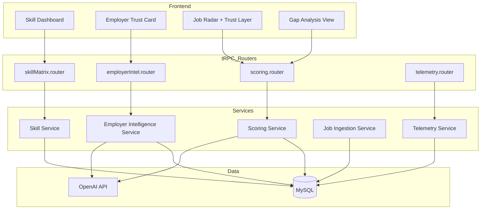
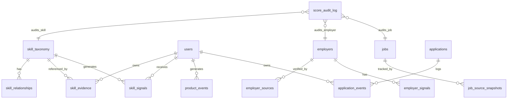
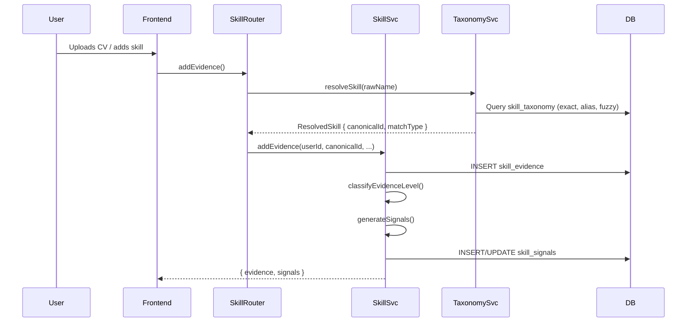
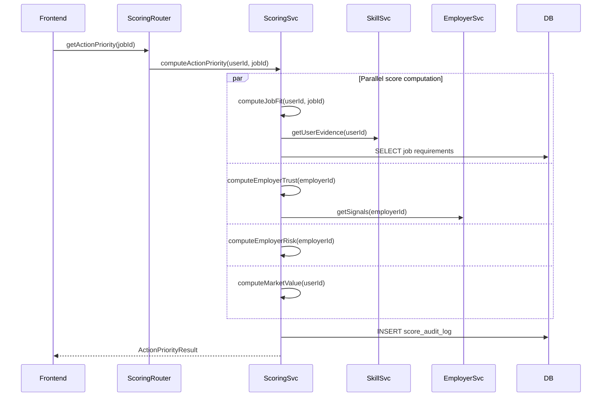
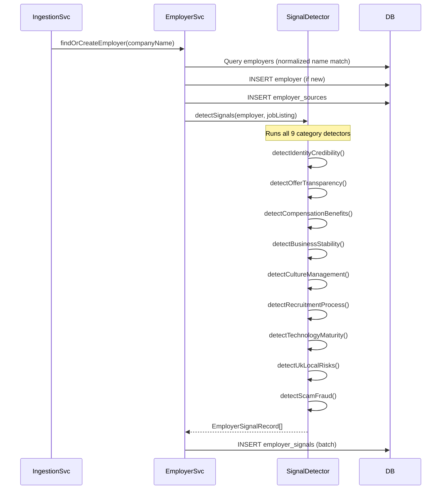

# Design Document: Skills & Employer Verification Matrix

## Overview

The Skills & Employer Verification Matrix transforms the existing string-based skill system into an evidence-backed, multi-dimensional scoring engine and adds comprehensive employer verification through trust/risk signals from multiple public and listing sources.

### Goals

1. **Evidence-Based Skills**: Replace flat `skills.name` strings with a normalized taxonomy, evidence records, and multi-dimensional scoring
2. **Employer Intelligence**: Build a persistent employer knowledge base with signals across 9 verification categories (A–I)
3. **Seven Core Scores**: Skill Readiness, Market Value, Evidence Strength, Job Fit, Employer Trust, Employer Risk, Action Priority — all 0-100
4. **Trust Transparency**: Every insight carries Trust_Metadata so users understand source, confidence, and freshness
5. **Audit Trail**: Immutable score audit log for reproducibility and compliance
6. **Credits Integration**: Paid AI actions (gap analysis, employer deep-dive, market comparison) use the existing credits reservation lifecycle

### Design Principles

- **Additive migration**: New tables and services extend the existing schema; the current `skills` table remains operational during transition
- **Service isolation**: Each domain (Skill, Employer, Scoring, Ingestion, Telemetry) is a separate service module with clear interfaces
- **Deterministic scoring**: Core scoring algorithms are pure functions (no AI) for reproducibility; AI is used only for signal extraction and summaries
- **Signal language**: All user-facing risk/trust text follows UX copy standards — observations, never judgments

---

## Architecture

### High-Level System Diagram



### Service Boundaries

| Service | Responsibility | Dependencies |
|---------|---------------|--------------|
| **Skill Service** | Taxonomy CRUD, evidence management, signal generation, skill normalization | MySQL, OpenAI (extraction) |
| **Employer Intelligence Service** | Employer records, source management, signal detection/storage | MySQL, OpenAI (signal extraction) |
| **Scoring Service** | All 7 score computations, audit log writes, AI summaries (paid) | MySQL, OpenAI, Credit Service |
| **Job Ingestion Service** | Provider ingestion, deduplication, source snapshots, normalization | MySQL, Provider APIs |
| **Telemetry Service** | Event recording, aggregation queries, feedback loop metrics | MySQL |

---

## Components and Interfaces

### 1. Skill Service (`backend/src/services/skillMatrix/`)

```typescript
// skillTaxonomy.service.ts
interface SkillTaxonomyService {
  resolveSkill(input: string): Promise<ResolvedSkill>;
  getCanonicalSkill(id: string): Promise<CanonicalSkill | null>;
  searchSkills(query: string, limit?: number): Promise<CanonicalSkill[]>;
  getRelatedSkills(skillId: string): Promise<SkillRelationship[]>;
  createPendingSkill(name: string): Promise<CanonicalSkill>;
}

interface ResolvedSkill {
  canonicalId: string;
  canonicalName: string;
  matchType: 'exact' | 'alias' | 'fuzzy' | 'pending';
  confidence: number;
}

interface CanonicalSkill {
  id: string;
  canonicalName: string;
  category: SkillCategory;
  aliases: string[];
  parentId: string | null;
  status: 'active' | 'pending_review';
  createdAt: Date;
}

type SkillCategory = 
  | 'programming_language' | 'framework' | 'tool' 
  | 'methodology' | 'soft_skill' | 'domain_knowledge' | 'certification';

interface SkillRelationship {
  fromSkillId: string;
  toSkillId: string;
  relationType: 'parent' | 'child' | 'related' | 'prerequisite';
  strength: number; // 0.0-1.0
}
```

```typescript
// skillEvidence.service.ts
interface SkillEvidenceService {
  addEvidence(input: AddEvidenceInput): Promise<SkillEvidence>;
  getEvidenceForSkill(userId: string, skillId: string): Promise<SkillEvidence[]>;
  getUserEvidence(userId: string): Promise<SkillEvidence[]>;
  classifyEvidenceLevel(evidence: SkillEvidence): EvidenceLevel;
  confirmEvidence(evidenceId: string, confirmed: boolean): Promise<void>;
  getBestEvidence(userId: string, skillId: string): Promise<SkillEvidence | null>;
}

interface AddEvidenceInput {
  userId: string;
  skillId: string;
  sourceType: EvidenceSourceType;
  sourceId: string | null;
  evidenceType: EvidenceLevel;
  evidenceText: string;
  evidenceUrl: string | null;
  occurredAt: Date;
  confidence: number;
  metadata: Record<string, unknown>;
}

type EvidenceLevel = 'declared' | 'observed' | 'demonstrated' | 'verified' | 'recent';
type EvidenceSourceType = 'cv' | 'github' | 'portfolio' | 'certificate' | 'interview' | 'profile' | 'job_listing';
```

```typescript
// skillSignals.service.ts
interface SkillSignalService {
  generateSignals(userId: string, skillId: string): Promise<SkillSignal[]>;
  getUserSignals(userId: string): Promise<SkillSignal[]>;
  getSignalsForJob(userId: string, jobId: string): Promise<SkillSignal[]>;
}

interface SkillSignal {
  id: string;
  userId: string;
  skillId: string;
  signalType: SkillSignalType;
  title: string;
  explanation: string;
  severity: 'info' | 'warning' | 'critical';
  metadata: Record<string, unknown>;
  trustMetadata: TrustMetadata;
  createdAt: Date;
}

type SkillSignalType = 
  | 'strength' | 'gap' | 'market_trend' | 'salary_leverage'
  | 'cv_value' | 'verification_needed' | 'learning_recommendation' | 'interview_risk';
```

### 2. Employer Intelligence Service (`backend/src/services/employerIntel/`)

```typescript
// employerIntel.service.ts
interface EmployerIntelligenceService {
  findOrCreateEmployer(name: string, website?: string): Promise<Employer>;
  addSource(employerId: string, source: EmployerSourceInput): Promise<EmployerSource>;
  detectSignals(employerId: string, jobListing: JobListingInput): Promise<EmployerSignalRecord[]>;
  getEmployerProfile(employerId: string): Promise<EmployerProfile>;
  getSignalsByCategory(employerId: string, category: SignalCategory): Promise<EmployerSignalRecord[]>;
}

interface Employer {
  id: string;
  name: string;
  normalizedName: string;
  website: string | null;
  market: string;
  registryId: string | null;
  createdAt: Date;
  updatedAt: Date;
}

interface EmployerSourceInput {
  sourceType: EmployerSourceType;
  sourceName: string;
  sourceUrl: string | null;
  observedAt: Date;
  confidence: number;
  rawData?: Record<string, unknown>;
}

type EmployerSourceType = 
  | 'companies_house' | 'job_listing' | 'glassdoor' | 'linkedin'
  | 'news' | 'crunchbase' | 'website_analysis' | 'social_media';

interface EmployerSignalRecord {
  id: string;
  employerId: string;
  signalType: string;
  category: SignalCategory;
  score: number;
  severity: 'positive' | 'neutral' | 'warning' | 'critical';
  title: string;
  explanation: string;
  sourceId: string;
  trustMetadata: TrustMetadata;
  createdAt: Date;
}

type SignalCategory = 
  | 'identity_credibility' | 'offer_transparency' | 'compensation_benefits'
  | 'business_stability' | 'culture_management' | 'recruitment_process'
  | 'technology_maturity' | 'uk_local_risks' | 'scam_fraud';
```

### 3. Scoring Service (`backend/src/services/scoring/`)

```typescript
// scoring.service.ts
interface ScoringService {
  computeSkillReadiness(userId: string, skillId: string): Promise<ScoredResult>;
  computeEvidenceStrength(userId: string, skillId: string): Promise<ScoredResult>;
  computeMarketValue(userId: string): Promise<ScoredResult>;
  computeJobFit(userId: string, jobId: string): Promise<JobFitResult>;
  computeEmployerTrust(employerId: string): Promise<ScoredResult>;
  computeEmployerRisk(employerId: string): Promise<ScoredResult>;
  computeActionPriority(userId: string, jobId: string): Promise<ActionPriorityResult>;
}

interface ScoredResult {
  score: number; // 0-100
  breakdown: Record<string, number>;
  trustMetadata: TrustMetadata;
  auditLogId: string;
}

interface JobFitResult extends ScoredResult {
  perSkillContribution: Array<{
    skillId: string;
    skillName: string;
    evidenceLevel: EvidenceLevel;
    contribution: number;
    matched: boolean;
  }>;
}

interface ActionPriorityResult extends ScoredResult {
  recommendation: 'apply_now' | 'save' | 'reject' | 'verify_employer';
  explanation: string;
  inputScores: {
    jobFit: number;
    employerTrust: number;
    employerRisk: number;
    marketValue: number;
    skillReadiness: number;
  };
}
```

### 4. Trust Metadata (shared type)

```typescript
// shared/trustMetadata.ts
interface TrustMetadata {
  sourceName: string;
  sourceUrl: string | null;
  sourceType: string;
  observedAt: Date;
  freshness: 'fresh' | 'recent' | 'aging' | 'stale';
  confidence: number; // 0.0-1.0
  explanationType: 'deterministic' | 'ai_generated' | 'heuristic' | 'user_reported';
  modelVersion: string;
  riskLanguage: boolean;
  userVisibleReason: string;
}

function computeFreshness(observedAt: Date, now: Date = new Date()): TrustMetadata['freshness'] {
  const daysSince = (now.getTime() - observedAt.getTime()) / (1000 * 60 * 60 * 24);
  if (daysSince <= 7) return 'fresh';
  if (daysSince <= 30) return 'recent';
  if (daysSince <= 90) return 'aging';
  return 'stale';
}
```

### 5. Telemetry Service (`backend/src/services/telemetry/`)

```typescript
// telemetry.service.ts
interface TelemetryService {
  recordEvent(event: ProductEventInput): Promise<void>;
  queryEvents(filter: EventFilter): Promise<ProductEvent[]>;
  getRecommendationAccuracy(scoreType: string, windowDays?: number): Promise<AccuracyMetrics>;
}

interface ProductEventInput {
  userId: string;
  eventName: string;
  entityType: string;
  entityId: string;
  metadata: Record<string, unknown>;
}

interface ProductEvent extends ProductEventInput {
  id: string;
  occurredAt: Date;
}
```

---

## Data Models

### New Database Tables (Drizzle ORM)

```typescript
// backend/src/db/schema-skills-matrix.ts

// ── Skill Taxonomy ────────────────────────────────────────────────────────────

export const skillTaxonomy = mysqlTable('skill_taxonomy', {
  id: varchar('id', { length: 36 }).primaryKey(),
  canonicalName: varchar('canonical_name', { length: 255 }).notNull().unique(),
  category: varchar('category', { length: 50 }).notNull(),
  // 'programming_language' | 'framework' | 'tool' | 'methodology' | 'soft_skill' | 'domain_knowledge' | 'certification'
  aliases: json('aliases').$type<string[]>().default([]),
  parentId: varchar('parent_id', { length: 36 }),
  status: varchar('status', { length: 20 }).notNull().default('active'),
  // 'active' | 'pending_review'
  metadata: json('metadata').$type<Record<string, unknown>>(),
  createdAt: timestamp('created_at').defaultNow().notNull(),
  updatedAt: timestamp('updated_at').defaultNow().onUpdateNow().notNull(),
});

export const skillRelationships = mysqlTable('skill_relationships', {
  id: varchar('id', { length: 36 }).primaryKey(),
  fromSkillId: varchar('from_skill_id', { length: 36 }).notNull(),
  toSkillId: varchar('to_skill_id', { length: 36 }).notNull(),
  relationType: varchar('relation_type', { length: 30 }).notNull(),
  // 'parent' | 'child' | 'related' | 'prerequisite'
  strength: decimal('strength', { precision: 3, scale: 2 }).notNull().default('0.50'),
  createdAt: timestamp('created_at').defaultNow().notNull(),
});

// ── Skill Evidence ────────────────────────────────────────────────────────────

export const skillEvidence = mysqlTable('skill_evidence', {
  id: varchar('id', { length: 36 }).primaryKey(),
  userId: varchar('user_id', { length: 36 }).notNull(),
  skillId: varchar('skill_id', { length: 36 }).notNull(), // FK to skill_taxonomy.id
  sourceType: varchar('source_type', { length: 50 }).notNull(),
  // 'cv' | 'github' | 'portfolio' | 'certificate' | 'interview' | 'profile' | 'job_listing'
  sourceId: varchar('source_id', { length: 36 }),
  evidenceType: varchar('evidence_type', { length: 30 }).notNull(),
  // 'declared' | 'observed' | 'demonstrated' | 'verified' | 'recent'
  evidenceText: text('evidence_text'),
  evidenceUrl: varchar('evidence_url', { length: 500 }),
  extractedAt: timestamp('extracted_at').defaultNow().notNull(),
  occurredAt: timestamp('occurred_at'),
  confidence: decimal('confidence', { precision: 3, scale: 2 }).notNull().default('0.50'),
  verifiedByUser: boolean('verified_by_user'),
  metadata: json('metadata').$type<Record<string, unknown>>(),
  createdAt: timestamp('created_at').defaultNow().notNull(),
  updatedAt: timestamp('updated_at').defaultNow().onUpdateNow().notNull(),
});

// ── Skill Signals ─────────────────────────────────────────────────────────────

export const skillSignals = mysqlTable('skill_signals', {
  id: varchar('id', { length: 36 }).primaryKey(),
  userId: varchar('user_id', { length: 36 }).notNull(),
  skillId: varchar('skill_id', { length: 36 }).notNull(),
  signalType: varchar('signal_type', { length: 50 }).notNull(),
  // 'strength' | 'gap' | 'market_trend' | 'salary_leverage' | 'cv_value' | 'verification_needed' | 'learning_recommendation' | 'interview_risk'
  title: varchar('title', { length: 255 }).notNull(),
  explanation: text('explanation').notNull(),
  severity: varchar('severity', { length: 20 }).notNull().default('info'),
  metadata: json('metadata').$type<Record<string, unknown>>(),
  trustMetadata: json('trust_metadata').$type<TrustMetadata>().notNull(),
  createdAt: timestamp('created_at').defaultNow().notNull(),
  expiresAt: timestamp('expires_at'),
});

// ── Employers ─────────────────────────────────────────────────────────────────

export const employers = mysqlTable('employers', {
  id: varchar('id', { length: 36 }).primaryKey(),
  name: varchar('name', { length: 255 }).notNull(),
  normalizedName: varchar('normalized_name', { length: 255 }).notNull(),
  website: varchar('website', { length: 500 }),
  market: varchar('market', { length: 50 }).notNull().default('uk'),
  registryId: varchar('registry_id', { length: 100 }), // Companies House number
  createdAt: timestamp('created_at').defaultNow().notNull(),
  updatedAt: timestamp('updated_at').defaultNow().onUpdateNow().notNull(),
});

export const employerSources = mysqlTable('employer_sources', {
  id: varchar('id', { length: 36 }).primaryKey(),
  employerId: varchar('employer_id', { length: 36 }).notNull(),
  sourceType: varchar('source_type', { length: 50 }).notNull(),
  // 'companies_house' | 'job_listing' | 'glassdoor' | 'linkedin' | 'news' | 'crunchbase' | 'website_analysis' | 'social_media'
  sourceName: varchar('source_name', { length: 255 }).notNull(),
  sourceUrl: varchar('source_url', { length: 500 }),
  observedAt: timestamp('observed_at').notNull(),
  confidence: decimal('confidence', { precision: 3, scale: 2 }).notNull().default('0.50'),
  rawData: json('raw_data').$type<Record<string, unknown>>(),
  createdAt: timestamp('created_at').defaultNow().notNull(),
});

export const employerSignals = mysqlTable('employer_signals', {
  id: varchar('id', { length: 36 }).primaryKey(),
  employerId: varchar('employer_id', { length: 36 }).notNull(),
  category: varchar('category', { length: 50 }).notNull(),
  // 'identity_credibility' | 'offer_transparency' | 'compensation_benefits' | 'business_stability' | 'culture_management' | 'recruitment_process' | 'technology_maturity' | 'uk_local_risks' | 'scam_fraud'
  signalType: varchar('signal_type', { length: 100 }).notNull(),
  score: int('score').notNull(), // -100 to +100 (negative = risk, positive = trust)
  severity: varchar('severity', { length: 20 }).notNull(),
  // 'positive' | 'neutral' | 'warning' | 'critical'
  title: varchar('title', { length: 255 }).notNull(),
  explanation: text('explanation').notNull(),
  sourceId: varchar('source_id', { length: 36 }),
  trustMetadata: json('trust_metadata').$type<TrustMetadata>().notNull(),
  createdAt: timestamp('created_at').defaultNow().notNull(),
  expiresAt: timestamp('expires_at'),
});

// ── Job Source Snapshots ──────────────────────────────────────────────────────

export const jobSourceSnapshots = mysqlTable('job_source_snapshots', {
  id: varchar('id', { length: 36 }).primaryKey(),
  jobId: varchar('job_id', { length: 36 }).notNull(),
  source: varchar('source', { length: 50 }).notNull(),
  firstSeenAt: timestamp('first_seen_at').notNull(),
  lastSeenAt: timestamp('last_seen_at').notNull(),
  contentHash: varchar('content_hash', { length: 64 }).notNull(), // SHA-256
  rawPayloadRef: varchar('raw_payload_ref', { length: 255 }), // S3 key or local ref
  sourceConfidence: decimal('source_confidence', { precision: 3, scale: 2 }).notNull().default('0.70'),
  createdAt: timestamp('created_at').defaultNow().notNull(),
});

// ── Score Audit Log ───────────────────────────────────────────────────────────

export const scoreAuditLog = mysqlTable('score_audit_log', {
  id: varchar('id', { length: 36 }).primaryKey(),
  entityType: varchar('entity_type', { length: 50 }).notNull(),
  // 'user_skill' | 'employer' | 'job_fit' | 'market_value' | 'action_priority'
  entityId: varchar('entity_id', { length: 36 }).notNull(),
  scoreType: varchar('score_type', { length: 50 }).notNull(),
  // 'skill_readiness' | 'evidence_strength' | 'market_value' | 'job_fit' | 'employer_trust' | 'employer_risk' | 'action_priority'
  inputHash: varchar('input_hash', { length: 64 }).notNull(), // SHA-256 of inputs
  output: json('output').$type<Record<string, unknown>>().notNull(),
  modelVersion: varchar('model_version', { length: 50 }).notNull(),
  generatedAt: timestamp('generated_at').defaultNow().notNull(),
});

// ── Product Events (Telemetry) ────────────────────────────────────────────────

export const productEvents = mysqlTable('product_events', {
  id: varchar('id', { length: 36 }).primaryKey(),
  userId: varchar('user_id', { length: 36 }).notNull(),
  eventName: varchar('event_name', { length: 100 }).notNull(),
  entityType: varchar('entity_type', { length: 50 }).notNull(),
  entityId: varchar('entity_id', { length: 36 }).notNull(),
  metadata: json('metadata').$type<Record<string, unknown>>(),
  occurredAt: timestamp('occurred_at').defaultNow().notNull(),
});

// ── Application Events ────────────────────────────────────────────────────────

export const applicationEvents = mysqlTable('application_events', {
  id: varchar('id', { length: 36 }).primaryKey(),
  applicationId: varchar('application_id', { length: 36 }).notNull(),
  userId: varchar('user_id', { length: 36 }).notNull(),
  eventType: varchar('event_type', { length: 50 }).notNull(),
  // 'created' | 'submitted' | 'response_received' | 'interview_scheduled' | 'offer_received' | 'rejected' | 'withdrawn'
  metadata: json('metadata').$type<Record<string, unknown>>(),
  snapshotScores: json('snapshot_scores').$type<{
    jobFit: number;
    employerTrust: number;
    employerRisk: number;
    actionPriority: number;
  }>(),
  occurredAt: timestamp('occurred_at').defaultNow().notNull(),
});
```

### Entity Relationship Diagram



---

## Scoring Algorithms

### Skill Readiness Score (0-100)

Aggregates six weighted dimensions into a single readiness value per skill per user.

```typescript
// backend/src/services/scoring/skillReadiness.ts

interface DimensionWeights {
  levelMatch: 0.25;
  evidenceStrength: 0.20;
  recency: 0.15;
  marketDemand: 0.15;
  roleRelevance: 0.15;
  transferability: 0.10;
}

function computeSkillReadiness(input: SkillReadinessInput): number {
  const weights: DimensionWeights = {
    levelMatch: 0.25,
    evidenceStrength: 0.20,
    recency: 0.15,
    marketDemand: 0.15,
    roleRelevance: 0.15,
    transferability: 0.10,
  };

  const dimensions = {
    levelMatch: computeLevelMatch(input.claimedLevel, input.requiredLevel),
    evidenceStrength: computeEvidenceStrengthDimension(input.evidence),
    recency: computeRecencyDimension(input.evidence),
    marketDemand: input.marketDemandScore,
    roleRelevance: input.roleRelevanceScore,
    transferability: computeTransferability(input.relationships),
  };

  const raw = Object.entries(weights).reduce(
    (sum, [key, weight]) => sum + dimensions[key as keyof typeof dimensions] * weight,
    0
  );

  return Math.round(Math.min(100, Math.max(0, raw)));
}
```

### Evidence Strength Score (0-100)

Based on highest evidence level, corroborating sources, and confidence.

```typescript
function computeEvidenceStrength(evidence: SkillEvidence[]): number {
  if (evidence.length === 0) return 0;

  const levelScores: Record<EvidenceLevel, number> = {
    declared: 20,
    observed: 40,
    demonstrated: 60,
    verified: 80,
    recent: 90,
  };

  // Highest level achieved
  const maxLevel = evidence.reduce(
    (max, e) => Math.max(max, levelScores[e.evidenceType]),
    0
  );

  // Corroboration bonus: multiple sources confirming the same skill
  const sourceCount = new Set(evidence.map(e => e.sourceType)).size;
  const corroborationBonus = Math.min(10, (sourceCount - 1) * 5);

  // Average confidence of top evidence
  const topEvidence = evidence
    .sort((a, b) => levelScores[b.evidenceType] - levelScores[a.evidenceType])
    .slice(0, 3);
  const avgConfidence = topEvidence.reduce((sum, e) => sum + e.confidence, 0) / topEvidence.length;
  const confidenceMultiplier = 0.7 + (avgConfidence * 0.3); // Range: 0.7-1.0

  return Math.round(Math.min(100, (maxLevel + corroborationBonus) * confidenceMultiplier));
}
```

### Recency Dimension (0-100)

Decay function based on time since last evidence occurrence.

```typescript
function computeRecencyDimension(evidence: SkillEvidence[]): number {
  if (evidence.length === 0) return 0;

  const now = Date.now();
  const mostRecent = evidence.reduce(
    (latest, e) => Math.max(latest, e.occurredAt?.getTime() ?? 0),
    0
  );

  if (mostRecent === 0) return 20; // No date = assume stale

  const monthsSince = (now - mostRecent) / (1000 * 60 * 60 * 24 * 30);

  // Decay curve: 100 at 0 months, ~80 at 6 months, ~50 at 12 months, ~20 at 24+ months
  if (monthsSince <= 6) return Math.round(100 - (monthsSince * 3.3));
  if (monthsSince <= 12) return Math.round(80 - ((monthsSince - 6) * 5));
  if (monthsSince <= 24) return Math.round(50 - ((monthsSince - 12) * 2.5));
  return 20; // Floor for very stale skills
}
```

### Market Value Score (0-100)

Represents the market value of a user's skill portfolio for their target role.

```typescript
function computeMarketValue(input: MarketValueInput): number {
  const { userSkills, targetRoleListings, targetMarket } = input;

  // Insufficient data check
  if (targetRoleListings.length < 50) {
    return { score: computeWithLimitedData(input), lowConfidence: true };
  }

  // Compute demand frequency for each user skill
  const skillDemand = userSkills.map(skill => {
    const frequency = targetRoleListings.filter(
      listing => listing.requiredSkills.includes(skill.canonicalId)
    ).length / targetRoleListings.length;

    const salaryLeverage = computeSalaryLeverage(skill, targetRoleListings);

    return { skill, frequency, salaryLeverage };
  });

  // Weight by salary leverage
  const weightedScore = skillDemand.reduce((sum, { frequency, salaryLeverage }) => {
    return sum + (frequency * salaryLeverage * 100);
  }, 0) / Math.max(1, skillDemand.length);

  // Coverage bonus: if user covers 80%+ of high-demand skills, score > 70
  const highDemandSkills = getHighDemandSkills(targetRoleListings);
  const coverage = highDemandSkills.filter(
    hd => userSkills.some(us => us.canonicalId === hd.skillId)
  ).length / Math.max(1, highDemandSkills.length);

  const coverageBonus = coverage >= 0.8 ? 15 : coverage >= 0.6 ? 8 : 0;

  return Math.round(Math.min(100, Math.max(0, weightedScore + coverageBonus)));
}
```

### Employer Trust Score (0-100)

Aggregates positive signals across all nine verification categories.

```typescript
function computeEmployerTrust(signals: EmployerSignalRecord[], sourceCount: number): number {
  // Category weights (A is highest)
  const categoryWeights: Record<SignalCategory, number> = {
    identity_credibility: 0.20,
    offer_transparency: 0.15,
    compensation_benefits: 0.12,
    business_stability: 0.12,
    culture_management: 0.10,
    recruitment_process: 0.10,
    technology_maturity: 0.08,
    uk_local_risks: 0.08,
    scam_fraud: 0.05, // Low weight for trust (high weight for risk)
  };

  // Group positive signals by category
  const positiveSignals = signals.filter(s => s.score > 0);
  const categoryScores: Record<string, number> = {};

  for (const [category, weight] of Object.entries(categoryWeights)) {
    const catSignals = positiveSignals.filter(s => s.category === category);
    if (catSignals.length === 0) {
      categoryScores[category] = 0;
      continue;
    }

    // Sum scores with diminishing returns within category
    const sorted = catSignals.sort((a, b) => b.score - a.score);
    let catScore = 0;
    for (let i = 0; i < sorted.length; i++) {
      const diminishingFactor = 1 / (1 + i * 0.5); // 1.0, 0.67, 0.5, 0.4...
      catScore += sorted[i].score * diminishingFactor;
    }

    categoryScores[category] = Math.min(100, catScore) * weight;
  }

  let trust = Object.values(categoryScores).reduce((sum, v) => sum + v, 0);

  // Cap at 60 if fewer than 3 verified sources
  if (sourceCount < 3) {
    trust = Math.min(60, trust);
  }

  return Math.round(Math.min(100, Math.max(0, trust)));
}
```

### Employer Risk Score (0-100)

Aggregates negative signals with Category I (scam/fraud) weighted highest.

```typescript
function computeEmployerRisk(signals: EmployerSignalRecord[]): number {
  const categoryWeights: Record<SignalCategory, number> = {
    scam_fraud: 0.30,           // Highest for risk
    identity_credibility: 0.15,
    offer_transparency: 0.12,
    compensation_benefits: 0.10,
    business_stability: 0.10,
    culture_management: 0.08,
    recruitment_process: 0.08,
    uk_local_risks: 0.05,
    technology_maturity: 0.02,
  };

  const negativeSignals = signals.filter(s => s.score < 0);

  let risk = 0;
  for (const [category, weight] of Object.entries(categoryWeights)) {
    const catSignals = negativeSignals.filter(s => s.category === category);
    const catRisk = catSignals.reduce((sum, s) => sum + Math.abs(s.score), 0);
    risk += Math.min(100, catRisk) * weight;
  }

  return Math.round(Math.min(100, Math.max(0, risk)));
}
```

### Job Fit Score (0-100)

Evidence-weighted skill matching against job requirements.

```typescript
function computeJobFit(input: JobFitInput): JobFitResult {
  const { userSkills, jobRequirements, userEvidence } = input;

  const evidenceBonuses: Record<EvidenceLevel, number> = {
    declared: 0.6,    // Penalty for unverified
    observed: 0.8,
    demonstrated: 1.0,
    verified: 1.15,   // Bonus for verified
    recent: 1.2,      // Highest bonus
  };

  const perSkillContribution = jobRequirements.map(req => {
    const userSkill = userSkills.find(us => us.canonicalId === req.skillId);
    if (!userSkill) {
      // Check transferable skills
      const transferable = findTransferableMatch(req.skillId, userSkills);
      if (transferable) {
        return {
          skillId: req.skillId,
          contribution: 0.4 * req.weight * transferable.strength,
          evidenceLevel: 'declared' as EvidenceLevel,
          matched: false,
          transferredFrom: transferable.fromSkillId,
        };
      }
      return { skillId: req.skillId, contribution: 0, evidenceLevel: null, matched: false };
    }

    const bestEvidence = getBestEvidence(userEvidence, userSkill.canonicalId);
    const evidenceLevel = bestEvidence?.evidenceType ?? 'declared';
    const evidenceMultiplier = evidenceBonuses[evidenceLevel];

    return {
      skillId: req.skillId,
      contribution: req.weight * evidenceMultiplier,
      evidenceLevel,
      matched: true,
    };
  });

  const totalWeight = jobRequirements.reduce((sum, r) => sum + r.weight, 0);
  const achievedWeight = perSkillContribution.reduce((sum, c) => sum + c.contribution, 0);
  const score = Math.round((achievedWeight / Math.max(1, totalWeight)) * 100);

  return { score: Math.min(100, score), perSkillContribution };
}
```

### Action Priority Score (0-100)

Synthesizes all scores into a single actionable recommendation.

```typescript
function computeActionPriority(input: ActionPriorityInput): ActionPriorityResult {
  const { jobFit, employerTrust, employerRisk, marketValue, skillReadiness } = input;

  // Weighted synthesis
  const raw = (
    jobFit * 0.35 +
    employerTrust * 0.20 +
    (100 - employerRisk) * 0.20 +
    marketValue * 0.15 +
    skillReadiness * 0.10
  );

  const score = Math.round(Math.min(100, Math.max(0, raw)));

  // Determine recommendation
  let recommendation: ActionPriorityResult['recommendation'];
  if (jobFit > 70 && employerTrust > 60 && employerRisk < 30) {
    recommendation = 'apply_now';
  } else if (jobFit > 50 && (employerTrust < 50 || employerRisk > 50)) {
    recommendation = 'verify_employer';
  } else if (jobFit < 40) {
    recommendation = 'reject';
  } else {
    recommendation = 'save';
  }

  return { score, recommendation, inputScores: input };
}
```

---

## tRPC Router Design

### New Routers

#### `skillMatrix.router.ts`

```typescript
export const skillMatrixRouter = router({
  // Taxonomy
  searchSkills: protectedProcedure
    .input(z.object({ query: z.string().min(1).max(200), limit: z.number().max(50).default(20) }))
    .query(/* ... */),

  getSkillDetails: protectedProcedure
    .input(z.object({ skillId: z.string() }))
    .query(/* ... */),

  // Evidence
  getUserEvidence: protectedProcedure
    .query(/* returns all evidence for current user */),

  addEvidence: protectedProcedure
    .input(addEvidenceSchema)
    .mutation(/* ... */),

  confirmEvidence: protectedProcedure
    .input(z.object({ evidenceId: z.string(), confirmed: z.boolean() }))
    .mutation(/* ... */),

  // Signals
  getUserSignals: protectedProcedure
    .query(/* returns all skill signals for current user */),

  getSignalsForJob: protectedProcedure
    .input(z.object({ jobId: z.string() }))
    .query(/* ... */),

  // Scores
  getSkillReadiness: protectedProcedure
    .input(z.object({ skillId: z.string() }))
    .query(/* ... */),

  getPortfolioOverview: protectedProcedure
    .query(/* returns all skill scores + signals summary */),

  // Migration
  syncFromLegacySkills: protectedProcedure
    .mutation(/* migrates current skills table entries to evidence model */),
});
```

#### `employerIntel.router.ts`

```typescript
export const employerIntelRouter = router({
  getEmployerProfile: protectedProcedure
    .input(z.object({ employerId: z.string() }))
    .query(/* ... */),

  getEmployerByName: protectedProcedure
    .input(z.object({ name: z.string().min(1) }))
    .query(/* ... */),

  getSignalsByCategory: protectedProcedure
    .input(z.object({ employerId: z.string(), category: signalCategorySchema.optional() }))
    .query(/* ... */),

  getTrustRiskScores: protectedProcedure
    .input(z.object({ employerId: z.string() }))
    .query(/* ... */),

  // UK-specific
  getUkSignals: protectedProcedure
    .input(z.object({ employerId: z.string() }))
    .query(/* ... */),

  // Feedback
  reportSignalInaccuracy: protectedProcedure
    .input(z.object({ signalId: z.string(), reason: z.string().max(500) }))
    .mutation(/* ... */),
});
```

#### `scoring.router.ts`

```typescript
export const scoringRouter = router({
  getJobFit: protectedProcedure
    .input(z.object({ jobId: z.string() }))
    .query(/* ... */),

  getActionPriority: protectedProcedure
    .input(z.object({ jobId: z.string() }))
    .query(/* ... */),

  getMarketValue: protectedProcedure
    .query(/* ... */),

  // Paid AI actions (use credits)
  analyzeSkillGaps: protectedProcedure
    .use(requireSpendApproval('skill_gap_analysis'))
    .input(z.object({ targetRole: z.string().optional() }))
    .mutation(/* ... */),

  employerDeepDive: protectedProcedure
    .use(requireSpendApproval('employer_deep_dive'))
    .input(z.object({ employerId: z.string() }))
    .mutation(/* ... */),

  marketComparison: protectedProcedure
    .use(requireSpendApproval('market_comparison'))
    .input(z.object({ targetRole: z.string().optional(), geography: z.string().optional() }))
    .mutation(/* ... */),

  // Feedback
  disagreeWithScore: protectedProcedure
    .input(z.object({
      scoreType: z.string(),
      entityId: z.string(),
      reason: z.string().max(500).optional(),
    }))
    .mutation(/* ... */),
});
```

#### `telemetry.router.ts`

```typescript
export const telemetryRouter = router({
  recordEvent: protectedProcedure
    .input(z.object({
      eventName: z.string().max(100),
      entityType: z.string().max(50),
      entityId: z.string().max(36),
      metadata: z.record(z.unknown()).optional(),
    }))
    .mutation(/* ... */),

  // Admin/internal
  getRecommendationAccuracy: protectedProcedure
    .input(z.object({ scoreType: z.string(), windowDays: z.number().default(30) }))
    .query(/* ... */),
});
```

---

## Frontend Components and State Management

### New Zustand Stores

#### `skillMatrixStore.ts`

```typescript
interface SkillMatrixStore {
  // State
  skills: CanonicalSkill[];
  evidence: SkillEvidence[];
  signals: SkillSignal[];
  scores: Record<string, number>; // skillId -> readiness score
  portfolioOverview: PortfolioOverview | null;
  isLoading: boolean;

  // Actions
  loadPortfolio: () => Promise<void>;
  addEvidence: (input: AddEvidenceInput) => Promise<void>;
  confirmEvidence: (evidenceId: string, confirmed: boolean) => Promise<void>;
  syncFromLegacy: () => Promise<void>;
  getSkillReadiness: (skillId: string) => Promise<number>;
}
```

#### `employerIntelStore.ts`

```typescript
interface EmployerIntelStore {
  // State
  currentEmployer: EmployerProfile | null;
  signals: EmployerSignalRecord[];
  trustScore: number | null;
  riskScore: number | null;
  isLoading: boolean;

  // Actions
  loadEmployer: (employerId: string) => Promise<void>;
  loadByName: (name: string) => Promise<void>;
  reportInaccuracy: (signalId: string, reason: string) => Promise<void>;
}
```

#### `scoringStore.ts`

```typescript
interface ScoringStore {
  // State
  jobFitScores: Record<string, JobFitResult>; // jobId -> result
  actionPriorities: Record<string, ActionPriorityResult>;
  marketValue: ScoredResult | null;
  isLoading: boolean;

  // Actions
  getJobFit: (jobId: string) => Promise<JobFitResult>;
  getActionPriority: (jobId: string) => Promise<ActionPriorityResult>;
  loadMarketValue: () => Promise<void>;
  disagreeWithScore: (scoreType: string, entityId: string, reason?: string) => Promise<void>;
}
```

### Key UI Components

| Component | Location | Purpose |
|-----------|----------|---------|
| `SkillEvidenceCard` | `frontend/src/components/skills/` | Shows skill with evidence level badge, confidence, and signals |
| `SkillPortfolioView` | `frontend/src/app/skills/` | Full skill portfolio with readiness scores and gap indicators |
| `EmployerTrustBadge` | `frontend/src/components/employer/` | Compact trust level indicator (verified/likely_legit/review/risky) |
| `EmployerRiskDrawer` | `frontend/src/components/employer/` | Expandable drawer showing all signals with Trust_Metadata |
| `ActionPriorityBadge` | `frontend/src/components/jobs/` | apply_now/save/reject/verify_employer CTA on job cards |
| `ScoreBreakdownPanel` | `frontend/src/components/scoring/` | Detailed score breakdown with per-dimension visualization |
| `TrustMetadataTooltip` | `frontend/src/components/shared/` | Reusable tooltip showing source, confidence, freshness |
| `GapAnalysisReport` | `frontend/src/app/skills/` | AI-generated gap analysis with learning recommendations |

---

## Data Flow Diagrams

### Skill Evidence Flow



### Job Fit Scoring Flow



### Employer Signal Detection Flow



---

## Migration Strategy

### Phase 1: Schema Addition (Non-Breaking)

1. Add all new tables via Drizzle migration (no changes to existing tables)
2. Deploy new schema alongside existing `skills` table
3. Both systems operate in parallel

### Phase 2: Data Backfill

1. **Taxonomy seeding**: Populate `skill_taxonomy` with ~2000 canonical skills from curated dataset (programming languages, frameworks, tools, methodologies, soft skills)
2. **Evidence migration**: For each existing `skills` row, create a `skill_evidence` record with:
   - `evidenceType: 'declared'`
   - `sourceType: 'profile'`
   - `confidence: 0.5`
   - `occurredAt: skills.createdAt`
3. **Employer seeding**: For each unique `jobs.company`, create an `employers` record with normalized name

```typescript
// backend/src/services/skillMatrix/migration.ts
async function migrateUserSkillsToEvidence(userId: string): Promise<void> {
  const profileId = await resolveProfileId(userId);
  if (!profileId) return;

  const existingSkills = await db.select().from(skills).where(eq(skills.profileId, profileId));

  for (const skill of existingSkills) {
    const resolved = await taxonomyService.resolveSkill(skill.name);

    await db.insert(skillEvidence).values({
      id: randomUUID(),
      userId,
      skillId: resolved.canonicalId,
      sourceType: 'profile',
      sourceId: skill.id,
      evidenceType: 'declared',
      evidenceText: `User declared skill: ${skill.name}`,
      confidence: '0.50',
      extractedAt: new Date(),
      occurredAt: skill.createdAt,
    });
  }
}
```

### Phase 3: Dual-Write

1. Profile save operations write to both `skills` (legacy) and `skill_evidence` (new)
2. Job Radar reads from new scoring system but falls back to legacy `fitScore` if unavailable
3. Existing `assessEmployerSignals()` in `jobProtection.ts` continues to work; new `EmployerIntelligenceService` provides richer data when available

### Phase 4: Cutover

1. Frontend switches to new skill portfolio view
2. Job Radar uses new Action Priority scores
3. Legacy `skills` table becomes read-only (kept for backward compatibility)
4. Old `assessEmployerSignals()` delegates to new service

---

## Error Handling

### Service-Level Error Strategy

| Error Type | Handling | User Impact |
|-----------|----------|-------------|
| Taxonomy resolution failure | Create pending entry, return with `matchType: 'pending'` | Skill added with "unverified" badge |
| Evidence extraction failure | Log error, skip evidence, continue with declared level | Reduced confidence score |
| Scoring computation failure | Return cached score if available, else return null with error flag | "Score unavailable" badge |
| Employer lookup failure | Create minimal employer record from job listing data | Limited trust data shown |
| OpenAI API failure | Fall back to deterministic heuristics (existing `jobProtection.ts` pattern) | Reduced signal richness |
| Credits insufficient | Block paid action, show cost and balance | "Insufficient credits" modal |
| Audit log write failure | Retry 3x, then log to error queue; never block score delivery | No user impact (background) |

### Error Types

```typescript
// backend/src/services/skillMatrix/errors.ts
export class SkillMatrixError extends Error {
  constructor(
    public code: 'TAXONOMY_RESOLUTION_FAILED' | 'EVIDENCE_EXTRACTION_FAILED' | 
                 'SCORING_FAILED' | 'EMPLOYER_LOOKUP_FAILED' | 'INSUFFICIENT_DATA',
    message: string,
    public metadata?: Record<string, unknown>
  ) {
    super(message);
    this.name = 'SkillMatrixError';
  }
}
```

### Graceful Degradation

- If the new scoring system is unavailable, Job Radar falls back to the existing `scoreJobFit()` in `aiPersonalizer.ts`
- If employer intelligence has no data, the existing `assessEmployerSignals()` heuristic from `jobProtection.ts` provides baseline signals
- All AI-powered features degrade to deterministic alternatives when OpenAI is unavailable

---

## Correctness Properties

*A property is a characteristic or behavior that should hold true across all valid executions of a system — essentially, a formal statement about what the system should do. Properties serve as the bridge between human-readable specifications and machine-verifiable correctness guarantees.*

### Property 1: Skill Resolution Round-Trip

*For any* canonical skill with aliases in the taxonomy, resolving any of its aliases should return the same canonical ID, and resolving the canonical name itself should also return that ID.

**Validates: Requirements 1.1, 1.2**

### Property 2: Unresolvable Skills Create Pending Entries

*For any* input string that does not match any canonical skill name, alias, or fuzzy threshold, the resolution function should create a new entry with status `pending_review` and return a valid temporary canonical ID.

**Validates: Requirements 1.4**

### Property 3: Evidence Classification Produces Exactly One Valid Level

*For any* skill evidence record with valid fields, the classification function should return exactly one value from the set {declared, observed, demonstrated, verified, recent} — never null, never multiple.

**Validates: Requirements 2.3**

### Property 4: Confidence Is Always Bounded

*For any* skill evidence record created or updated by the system, the confidence value should always be in the range [0.0, 1.0] inclusive.

**Validates: Requirements 2.4**

### Property 5: Evidence Confirmation Adjusts Confidence Directionally

*For any* evidence record with initial confidence C, confirming it (verifiedByUser = true) should produce confidence >= C, and rejecting it (verifiedByUser = false) should produce confidence <= C.

**Validates: Requirements 2.5**

### Property 6: Best Evidence Selection

*For any* set of evidence records for a given (userId, skillId) pair, `getBestEvidence` should return the record with the highest confidence, using most-recent `occurredAt` as tiebreaker.

**Validates: Requirements 2.6**

### Property 7: Stale Evidence Flagging

*For any* skill where all evidence records have `occurredAt` older than 24 months and no newer evidence exists, the skill should be flagged as potentially stale. Conversely, if any evidence is within 24 months, the skill should NOT be flagged as stale.

**Validates: Requirements 2.7**

### Property 8: All Scores Are Bounded [0, 100]

*For any* valid inputs to any of the seven score computation functions (Skill Readiness, Evidence Strength, Market Value, Job Fit, Employer Trust, Employer Risk, Action Priority), the output score should always be an integer in the range [0, 100].

**Validates: Requirements 3.2, 6.1, 7.1, 8.1, 9.1, 10.1**

### Property 9: Recency Is Monotonically Decreasing With Age

*For any* two dates A and B where A is more recent than B, the recency dimension score for A should be greater than or equal to the recency dimension score for B.

**Validates: Requirements 3.4**

### Property 10: Skill Readiness Equals Weighted Sum

*For any* set of six dimension scores, the Skill Readiness Score should equal the weighted sum: levelMatch×0.25 + evidenceStrength×0.20 + recency×0.15 + marketDemand×0.15 + roleRelevance×0.15 + transferability×0.10, rounded and clamped to [0, 100].

**Validates: Requirements 3.1, 3.2**

### Property 11: Employer Trust Weights Category A Highest

*For any* single positive signal with the same raw score, placing it in Category A (identity_credibility) should produce a higher trust score contribution than placing the same signal in any other category.

**Validates: Requirements 6.2**

### Property 12: Employer Risk Weights Category I Highest

*For any* single negative signal with the same raw score, placing it in Category I (scam_fraud) should produce a higher risk score contribution than placing the same signal in any other category.

**Validates: Requirements 7.2**

### Property 13: Diminishing Returns Within Same Category

*For any* employer and any signal category, adding the Nth positive signal to that category should produce a smaller marginal trust increase than adding the (N-1)th signal (for N > 1).

**Validates: Requirements 6.4**

### Property 14: Trust Capped at 60 When Sources < 3

*For any* employer with fewer than 3 verified sources in `employer_sources`, the computed Employer Trust Score should never exceed 60, regardless of how many positive signals exist.

**Validates: Requirements 6.5**

### Property 15: Trust and Risk Are Independent

*For any* employer, changing only the positive signals (trust inputs) should not change the Risk Score, and changing only the negative signals (risk inputs) should not change the Trust Score.

**Validates: Requirements 7.6**

### Property 16: Higher Evidence Level Produces Higher Job Fit Contribution

*For any* matched skill in a job fit computation, the contribution of that skill with evidence level `verified` or `recent` should be strictly greater than the contribution of the same skill with evidence level `declared`.

**Validates: Requirements 8.2, 8.4, 8.5**

### Property 17: Action Priority Recommendation Matches Rule Table

*For any* set of input scores (jobFit, employerTrust, employerRisk, marketValue, skillReadiness), the recommendation should be:
- `apply_now` when jobFit > 70 AND employerTrust > 60 AND employerRisk < 30
- `verify_employer` when jobFit > 50 AND (employerTrust < 50 OR employerRisk > 50)
- `reject` when jobFit < 40
- `save` otherwise

**Validates: Requirements 10.2, 10.3, 10.4, 10.5**

### Property 18: Audit Log Written for Every Score Computation

*For any* score computation that completes successfully, there should exist a corresponding entry in `score_audit_log` with matching entityType, entityId, scoreType, and a valid inputHash.

**Validates: Requirements 3.8, 6.7, 7.8, 8.8, 9.7, 10.8, 11.1**

### Property 19: Trust Metadata Present on Every Insight

*For any* generated signal, computed score, or AI-produced insight, the Trust_Metadata object should be present and contain all required fields (sourceName, sourceType, observedAt, freshness, confidence, explanationType, modelVersion, userVisibleReason) with non-null values.

**Validates: Requirements 4.7, 6.6, 10.7, 24.1, 24.2**

### Property 20: No Forbidden Phrases in Risk Communications

*For any* user-facing risk explanation, recommendation text, or signal description generated by the system, the text should never contain the phrases "This employer is bad", "AI verified this company", "You are missing X, do not apply", or any definitive judgment language.

**Validates: Requirements 7.7, 10.6, 26.1, 26.2, 26.3, 26.4**

### Property 21: Content Hash Is Deterministic

*For any* job listing content, computing the content hash twice with the same input should produce the same hash value. Different content should produce different hash values (collision resistance).

**Validates: Requirements 15.3, 15.4**

### Property 22: UK Signal Detection Matches Keyword Presence

*For any* job listing text, if the text contains a visa sponsorship keyword pattern, a `visa_sponsorship` signal should be generated. If it contains an IR35 keyword pattern, an `ir35_status` signal should be generated. Absence of keywords should produce no signal for that type.

**Validates: Requirements 17.2, 17.3, 17.4**

### Property 23: Credits Balance Invariant

*For any* sequence of credit operations (reserve → commit OR reserve → release), the final balance should equal: initial_balance - sum(committed_charges). Released reservations should not affect the balance.

**Validates: Requirements 13.2, 13.3, 13.4**

### Property 24: Employer Name Normalization Is Idempotent

*For any* employer name string, applying the normalization function twice should produce the same result as applying it once: normalize(normalize(x)) === normalize(x).

**Validates: Requirements 5.4**

---

## Testing Strategy

### Property-Based Testing

**Library**: [fast-check](https://github.com/dubzzz/fast-check) (TypeScript PBT library)

**Configuration**: Minimum 100 iterations per property test.

**Tag format**: `Feature: skills-employer-matrix, Property {number}: {property_text}`

Each of the 24 correctness properties above will be implemented as a single property-based test using fast-check. The scoring algorithms are pure functions, making them ideal candidates for PBT.

### Test Organization

```
backend/src/services/skillMatrix/__tests__/
├── skillTaxonomy.property.test.ts      (Properties 1, 2, 24)
├── skillEvidence.property.test.ts      (Properties 3, 4, 5, 6, 7)
├── scoring.property.test.ts            (Properties 8, 9, 10, 11, 12, 13, 14, 15, 16, 17)
├── auditLog.property.test.ts           (Property 18)
├── trustMetadata.property.test.ts      (Property 19)
├── uxCopy.property.test.ts             (Property 20)
├── jobIngestion.property.test.ts       (Property 21)
├── ukSignals.property.test.ts          (Property 22)
├── credits.property.test.ts            (Property 23)
└── integration/
    ├── employerIntel.integration.test.ts
    ├── adzunaProvider.integration.test.ts
    ├── aiGapAnalysis.integration.test.ts
    └── dataPrivacy.integration.test.ts
```

### Unit Tests (Example-Based)

Unit tests complement property tests for:
- Specific edge cases (empty inputs, maximum lengths, null handling)
- Integration points between services (router → service → DB)
- UI component rendering (employer trust badge thresholds)
- API contract validation (tRPC input/output schemas)

### Integration Tests

- Adzuna UK API integration (mocked responses)
- AI-powered features (mocked OpenAI responses)
- Data deletion workflow (end-to-end)
- Credits lifecycle (reserve → execute → commit/release)
- Migration script (legacy skills → evidence model)

### Test Priorities

| Priority | Tests | Coverage |
|----------|-------|----------|
| P0 | Scoring algorithm properties (8-17) | Core business logic correctness |
| P0 | Evidence model properties (3-7) | Data integrity |
| P1 | Taxonomy resolution (1, 2, 24) | Skill normalization |
| P1 | Trust/audit invariants (18, 19, 20) | Compliance |
| P2 | Ingestion/UK signals (21, 22) | Feature completeness |
| P2 | Credits (23) | Billing correctness |
