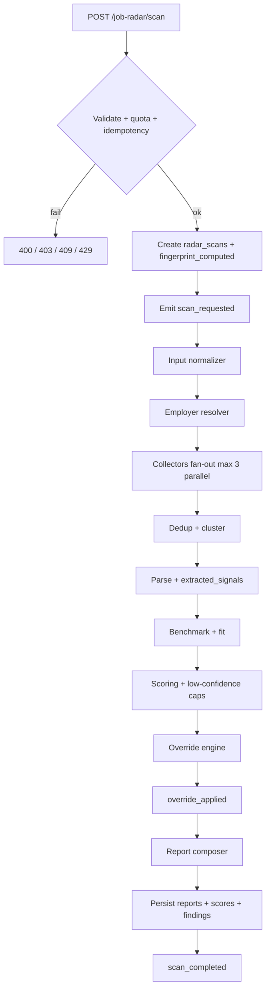
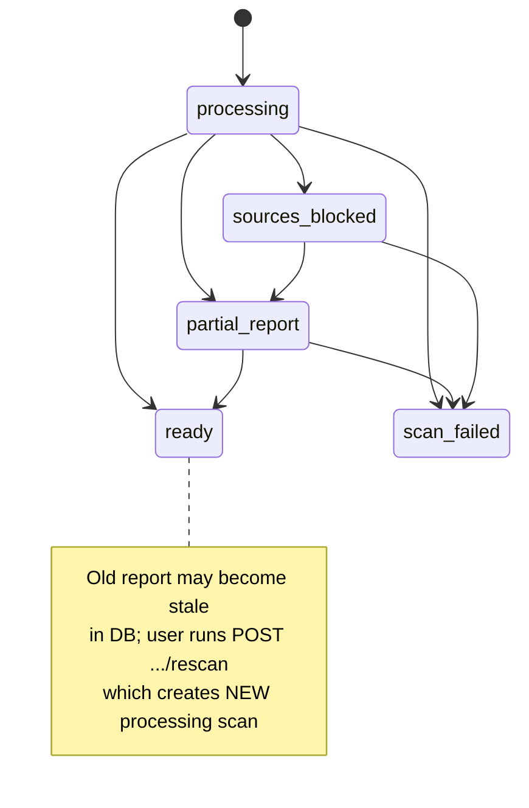

# JobRadar — event flow & pipeline (v1.1 final)

Complements `job-radar-openapi-v1.1.yaml` and `job-radar-sql-schema-v1.sql`.

## Separation of concerns

| Concept | Where it lives |
| --- | --- |
| Pipeline state | `scan.status` — `processing` \| `partial_report` \| `ready` \| `sources_blocked` \| `scan_failed` |
| Data staleness | `report.freshness.freshness_status` — `fresh` \| `acceptable` \| `stale` |
| Never use `stale` as a **scan** status — avoids UI/backend confusion (“ready but outdated”). |

## High-level flow

## Scan state machine

`stale` data does **not** change `scan.status`; it only updates `report.freshness`. A **new** rescan creates a **new** `scan_id`.

## Benchmark compute — single path (invariant)

**Do not add a second benchmark computation path.** In the current module:

1. **Only** `ScanOrchestratorService.finalizeBasic` calls `ComputeBenchmarkHandler.execute({ scanId })` (after dedupe + conflict resolution, when the scan is not `sources_blocked` / `scan_failed` on the parse outcome path).
2. `ComputeBenchmarkHandler` runs `BenchmarkEngineService.compute(scanId)` (persist benchmark / signals as implemented), then **enqueues** `benchmark_ready` on the outbox.
3. In `processJobRadarOutbox` (`backend/src/modules/job-radar/infrastructure/process-job-radar-outbox.ts`), `benchmark_ready` is listed in **`AUDIT_ONLY_EVENTS`**: the row is consumed and **marked published with no worker side-effect** (same treatment as cache-hit / fetch lifecycle audit events). It exists for **audit / observability**, not to trigger another compute.

If you need downstream reactions to benchmarks, extend explicit worker routing — do **not** re-invoke `BenchmarkEngineService.compute` from the outbox loop for the same scan.

## Internal events (outbox / queue)

| Event | When |
| --- | --- |
| `scan_requested` | API accepted scan after quota/idempotency |
| `fingerprint_computed` | Dedupe key + entity/source fingerprints ready |
| `input_normalized` | Employer string, URL, role, location normalized |
| `employer_resolved` | `employer_id` + aliases |
| `collectors_started` | Orchestrator dispatched collectors |
| `source_collected` | Row in `collected_sources` |
| `source_deduplicated` | Cluster id + content_hash grouping applied |
| `source_parsed` | `parse_status` updated |
| `signals_extracted` | Rows in `extracted_signals` |
| `conflicts_resolved` | Tier/freshness rules applied |
| `benchmark_ready` | Emitted **after** benchmark rows are written inside `ComputeBenchmarkHandler`; outbox consumer treats it as **audit-only** (no pipeline handler) |
| `benchmark_resolved` | `market_benchmarks` row selected or fallback |
| `fit_computed` | User prefs vs offer/employer |
| `scores_computed` | `radar_scores` + `score_drivers` |
| `override_applied` | Override engine capped recommendation / forced finding |
| `report_generated` | `radar_reports` JSON blobs written |
| `scan_completed` | Terminal `scan.status` set |

## Idempotency & fingerprint

1. **Entity fingerprint** — `sha256(canonical_employer | normalized_role_family | normalized_location | normalized_source_url)` (exact formula in backend constants).
2. **Source fingerprint** — hash of canonical URL + optional content hash after fetch.
3. `Idempotency-Key` + identical body within TTL → same `scan_id` (202).
4. Same key + different body → `409` + `IDEMPOTENCY_KEY_REUSED_WITH_DIFFERENT_PAYLOAD`.

## Partial report threshold (implementation hint)

Generate `partial_report` only if:

- employer resolved, and  
- ≥ 2 collected sources after dedup, and  
- ≥ 2 of 6 scores computed, and  
- at least one finding with medium/high confidence **or** multiple low (per PRD).

## Related files

- `docs/job-radar/job-radar-openapi-v1.1.yaml`
- `docs/job-radar/job-radar-sql-schema-v1.sql`
